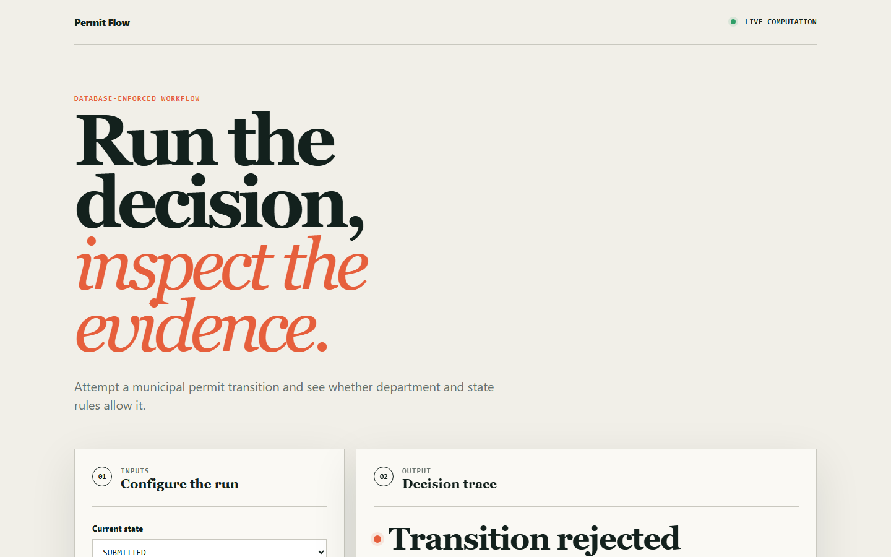
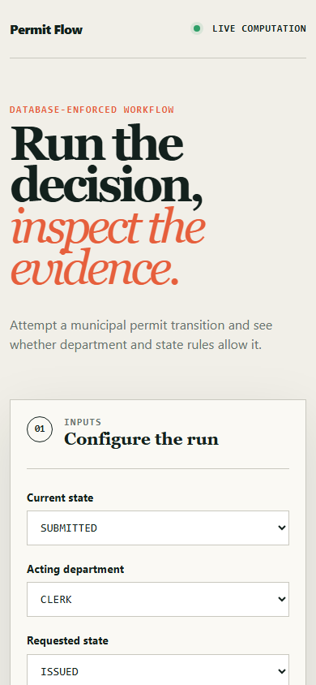

# permitflow

> Municipal permitting where illegal workflow transitions are rejected by the database, not by a service layer somebody will bypass.

## Live deployment

[](https://github.com/SlateGitOrg/permitflow/actions/workflows/ci.yml)

[Open the working Permit Flow application](https://slategitorg.github.io/permitflow/)

This deployed application runs the project's decision workflow in the browser. Change the inputs, run the analysis, and inspect the computed metrics and decision trace.

### Desktop



### Mobile



`FLAGSHIP` · **Full Stack Engineering** · Advanced · ~4-5 weeks · Public sector

**Primary language:** TypeScript
**Tags:** `postgres`, `state-machines`, `sql`, `constraints`, `audit`, `govtech`

---

## The problem

Municipal permit applications move through dozens of conditional stages across several departments. When status is a free-text column, applications reach impossible states - approved but never inspected, refunded but still active - and nobody can reconstruct how it happened. Citizens then wait months with no visibility, and the only recourse is a phone call to somebody who also cannot see the history.

## ⭐ The differentiator

The workflow is a **declared statechart that compiles to database constraints**: a generated transition table plus a trigger means an illegal transition is rejected by PostgreSQL, not merely by application code. A generic version stores `status` as a string and enforces transitions in a service layer that a second code path - a bulk import, an admin tool, a migration script - inevitably bypasses. The same compiled artefact also generates the citizen-facing 'what happens next' view, so the public page cannot drift from the real process.

This is the sentence to lead with when someone asks you to walk through the
project. Everything else in this repo exists to make it true and to prove it.

## Data

A synthetic generator modelled on published municipal open-permit schemas (NYC DOB, SF DBI), simulating 50,000 applications with realistic per-stage dwell times and a documented 3% rate of planted illegal-transition attempts - including attempts issued as raw SQL, bypassing the application entirely.

> No paid API key is required to run or demo this project. Where a paid
> service would add value it is wired as an optional enhancement behind an
> interface with an offline mock as the default implementation.

## Stack

- TypeScript, Remix (server-rendered, progressive enhancement - it is a government service)
- XState for the statechart definition
- PostgreSQL: generated transition table, trigger enforcement, full history
- Zod for boundary validation; Vitest for the suite
- Docker Compose

## Core capabilities

- A single statechart definition compiling to migration SQL (transition table + trigger) *and* TypeScript types
- Complete transition history with actor, timestamp and reason, queryable as a per-application timeline
- Department queue views with SLA-breach highlighting derived from stage entry timestamps
- Citizen status page rendering the live statechart path, generated from the same definition as the engine
- Bulk reassignment that is transactional across departments - partial application is impossible

## Repository layout

```
app/                      # Remix routes, loaders, actions
workflow/                 # machine.ts (source of truth) + compile.ts
db/migrations/            # generated; checked in and reviewed
sim/                      # application generator incl. illegal attempts
test/                     # property + integration suites
```

## Build plan

1. Write the statechart for one permit type. Get the compiler emitting SQL before building any UI.
2. Prove the DB rejects illegal transitions issued as raw SQL. This is the whole project - do it on day three.
3. Add history, then department queues, then the citizen view.
4. Generate the citizen 'what happens next' copy from the machine so it cannot drift.

## Testing strategy

A property-based suite enumerates **every illegal transition in the state space** and asserts PostgreSQL rejects each one. Critically, a bypass test issues those transitions over a raw connection with the service layer entirely out of the loop - if that test passes only because of application code, it is not testing the differentiator. Integration tests assert the citizen view and the engine agree on next-steps for every reachable state.

Tests assert **correctness**, not merely that the code runs. A green suite on
this repo is a claim about behaviour under adversarial conditions; treat any
test that would pass against a deliberately broken implementation as a bug in
the test.

## Quality & safety layer

Every state change is attributable: actor, timestamp, reason. The history table is append-only and enforced as such, so the audit trail survives an application bug.

## Measurable outcome

> Zero applications reach an invalid state across 50,000 simulated submissions, and median time-to-status-answer for a citizen drops from a phone call to a page load.

State it in these terms — business units, not technical ones — in your CV
bullet and in the first thirty seconds of describing the project.

## Interview questions this project answers

- **Where do you put invariants - application, database, or both?**
- **How do you evolve a state machine that has live records mid-flight?**
- **What happens when a second service writes to your tables?**

## What this deliberately is *not*

- Not a workflow-builder product. One well-modelled process beats a generic engine nobody can reason about.
- Not a CRUD app with a status dropdown, which is what this becomes if you skip the compiler.


## Run it now

```bash
npm test        # runs the suite; no install step needed
npm run demo    # the 60-second artefact
```

Requires Node 22.6+ (24 recommended). TypeScript runs natively via
type stripping - there is no build step and no `node_modules`.

## Getting started

```bash
git clone <your-fork-url> permitflow
cd permitflow
docker compose up -d
npm install
npm run workflow:compile      # statechart -> migrations + types
npm run db:migrate
npm run sim                   # 50k applications
npm run test                  # incl. the raw-SQL bypass suite
npm run dev
```

Docker is supported but optional — every path above works on a plain
Windows/macOS/Linux laptop without a cloud account.

## Definition of done

- [ ] The differentiator above is implemented, and a test proves it
- [ ] The measurable outcome is produced by a command anyone can run
- [ ] `README` explains the one decision a generic version gets wrong
- [ ] CI runs the full suite on every push and is green on `main`
- [ ] A recruiter can see the headline artefact in under 60 seconds

## Licence

MIT — see [LICENSE](LICENSE).
